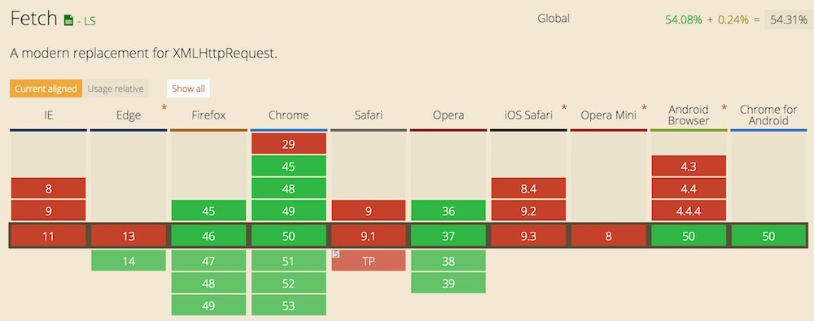
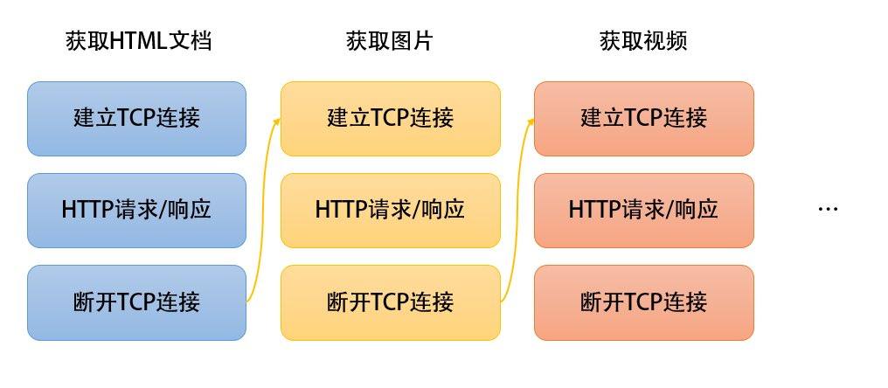
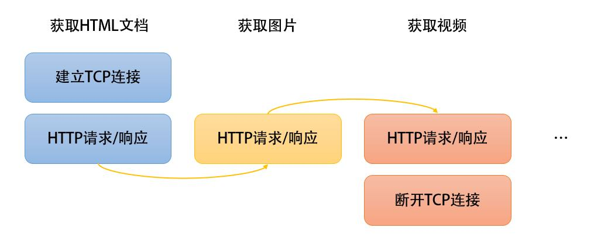
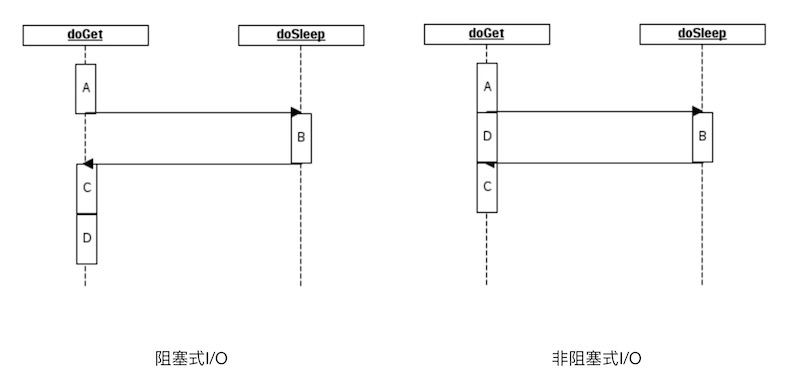
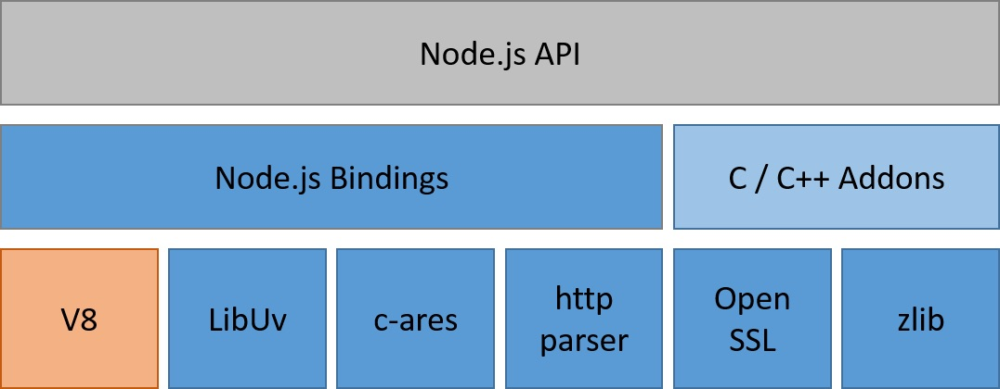
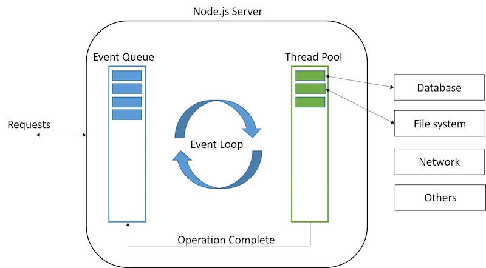
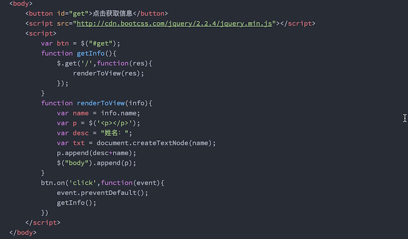
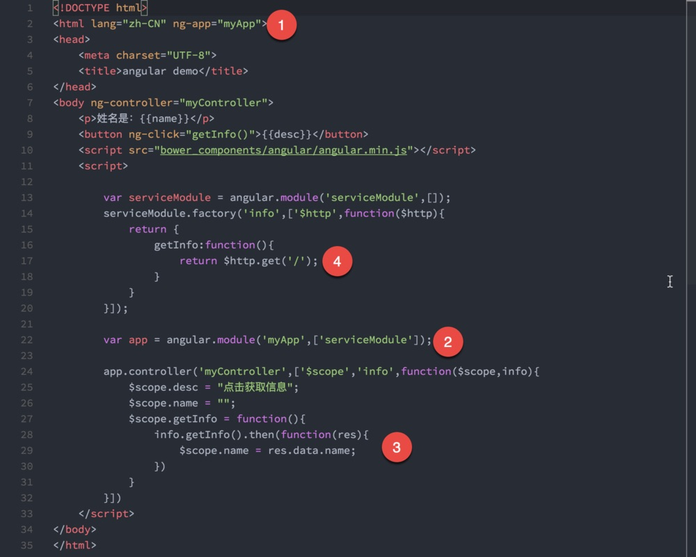

# 前端魔法堂
软件学院2013级-苏靖鑫


## `手机轻扫`二维码，获取PPT


## 概要

0. Web系统发展坎坷史
1. `HTML`,`CSS`,`JavaScript`——Web系统三剑客
2. `HTTP`——连接客户端与服务器端的纽带
3. `Ajax`——富Web时代的奠基者
4. `JSON`——简洁的数据传递者
5. `Node.js`——前端工程师愈发重要的契机
6. `React`——迎来前端组件化开发时代


## Web系统发展坎坷史

- **纷杂：**浏览器有着不同的阵营，W3C，不同浏览器实现机制不同，兼容性不一样，`www.caniuse.com`
- **变更频繁：**主要是指语言本身的更新，Web开发者需要保持长时间的不断坚持的学习速度。
- **多设备平台：**由传统PC平台转移至手机，平板等设备
- **用户需求：**用户的需求已不单单是获取资源那么简单，他们要什么，我们就得给什么




浏览器兼容性矩阵图


## `HTML`,`CSS`,`JavaScript`——Web系统三剑客


### HTML与CSS

Web系统的开发需要抓住一个核心，那便是**简单**，浏览器是呈现界面的地方，没有理由把它做的繁杂。

- `HTML`仅仅是由一系列的标签组成的，而`CSS`仅仅是一系列简单的描述层叠起来作用的。
- 页面不仅仅需要呈现给用户，还需要给予用户交互的权利，`JavaScript`来实现。


- `HTML`仅仅是由一系列标记组成的
- `CSS`仅仅是由一堆堆样式快堆叠组成的
- `JavaScript`是一门编程语言，它是由一系列API构成的
- `HTML5`,`CSS3`仅仅是相对于上者多了些内容和新的标准，并不是开创了新的形式


### 一个最简单的HTML页面

```html
<!DOCTYPE html>
<html lang="en">
<head>
	<meta charset="UTF-8">
	<title>Document</title>
</head>
<body>
	
</body>
</html>
```


### 一个最简单的CSS

```css
#id{
    color:red;
    font-size:25px;    
}
.class{
    padding: 10px 15px 25px 30px;
}
```


### 一段最简单的JavaScript

```js
    function hello(){
        console.log('Hello World');
    }
    hello();
```


### Example-当没有css的时候


## 当我们在浏览器里面输入`URL`并点击回车的时候，浏览器到底都做了什么？


我们可以看到有许多Web技术，但是大部分其实是局限在这个方面内做的一些更新和优化，至今，并且再可预见的未来，唯一不变的是：`如何从服务器获取资源？`


1. 进行`DNS解析`，将域名（`为人服务的`）转变为相对应的IP地址（`为机器服务的`）
2. 拿到IP地址的时候，我们就会向`服务器`发起连接请求（`请求是什么形式的`）？
3. 连接建立后，开始向服务器请求资源
4. 服务器返回资源（`资源不仅仅是文本（字符流），也可以是图像，影音（二进制流）`）


## 核心:HTTP协议


一段简单的HTTP请求


Request

```
GET / HTTP/1.1 # 请求方式 HTTP版本
Host: localhost:8080 # 请求主机
Connection: keep-alive # 连接方式
Pragma: no-cache
Cache-Control: no-cache # 缓存控制
Accept: text/html,application/xhtml+xml,application/xml;q=0.9,image/webp,*/*;q=0.8 #可接受的类型
Upgrade-Insecure-Requests: 1
User-Agent: Mozilla/5.0 (Macintosh; Intel Mac OS X 10_11_4) AppleWebKit/537.36 (KHTML, like Gecko) Chrome/50.0.2661.102 Safari/537.36
Accept-Encoding: gzip, deflate, sdch
Accept-Language: zh-CN,zh;q=0.8,en;q=0.6
Cookie: Webstorm-3ffb57cb=345662fd-2290-4fc7-9601-0e58653a485e;
```


Response

```
HTTP/1.1 200 OK # HTTP版本 请求状态码 请求结果
Server: nginx/1.10.0
Date: Tue, 24 May 2016 12:05:57 GMT
Content-Type: text/html; charset=utf-8
Transfer-Encoding: chunked
Connection: keep-alive
Content-Encoding: gzip
```


### 告知服务器意图的HTTP方法

发送HTTP的方法有许多种，最常用的便是GET和POST，下面就这两种进行详细地说明。

- `GET`方法用来请求访问URI所指定的资源，（我想访问你的某个资源）并不对服务器上的内容产生任何作用结果；每次GET的内容都是相同的（`等幂Idempotence`）。GET方式把请求所需要的参数放到URL中，直接就可以在URL中看见，有大小限制

- `POST`方法用来传输实体主体，目的并不是获取响应的主体内容，（我要把这条信息告诉你），POST方式则是把内容放在报文内容中


### 总结

GET用于获取某个内容，POST用于提交某种数据请求。

按照使用场景来说，一般用户注册的内容属于私密的，这应该使用POST方式；而针对某一内容的查询，为了快速的响应，可以使用GET方式。

> 问题：GET请求参数发送有限制吗？POST有限制吗？如果有，是谁在限制它们？


### 提升性能的方式

未开启持久连接




### 开启持久连接

持久连接的特点是，只要任意一端没有明确提出断开连接，则保持TCP连接状态




### `Ajax`——富Web时代的奠基者


### 什么是`Ajax`？为什么要使用它？

`Ajax`全称 `Asynchronous JavaScript and XML`，终结了“单击，等待”的交互模式，它是指一种创建交互式网页应用的网页开发技术，`Ajax`并不是一种技术，它是一系列规范的集合，包含：

- 基于web标准XHTML+CSS的表示；
- 使用 `DOM`（Document ObjectModel）进行动态显示及交互；
- 使用 `XML` 和 `XSLT` 进行数据交换及相关操作；
- 使用 `XMLHttpRequest` 进行异步数据查询、检索；
- 使用 `JavaScript` 将所有的东西绑定在一起。


### 一句话总结
在你背后默默为你获取数据的家伙


### 使用Ajax的情景

- 表单提交
- 动态更改页面信息（文字直播，微博新消息提示）
- 其他一切都需要和后端进行交互的过程


### Example-不使用Ajax是什么样子的


### 创建一个`XMLHttpRequest`对象

```js
var xhr = new XMLHttpRequest();
```


### 指派请求成功后需要做的事情

```js
xhr.onreadystatechange = function(){
    if(xhr.status==200 && xhr.readystate==4){    
        // 从xhr对象的responseText属性获取返回值
        console.log(xhr.responseText);
    }
};
```


### 打开对目标主机的一个请求

```js
xhr.open("get","./content.txt");
```


### 发起请求

```js
xhr.send(null);
```


### 提交表单


### 核心

```js
xhr.setRequestHeader("Content-Type","application/x-www-form-urlencoded");
```


## `JSON`


### `Ajax`为什么几乎不用`XML`了？

因为`JSON`比`XML`简单且简洁，是的，我们是一路追求简洁的


## 30秒理解JSON

```json
{
    "name":"LuckyJing",
    "age":21,
    "boy":true,
    "money":null,
    "school":{
                "name":"XiDian University"
    },
    "skills":["html","css","JavaScript"]
}
```


## 序列化JSON & 解析JSON

```js
var obj = {"name":"LuckyJing"}
var JsonStr = JSON.stringify(obj);
var obj1 = JSON.parse(JsonStr);
```


## 如何在HTTP中使用JSON

JSON传递的时候，本身也就是字符串，只不过赋予了特殊的含义，只需要设置传递类型即可，在执行`xhr.send()`的时候，传递给`send`的参数为`序列化过后的JSON字符串`。
```js
xhr.setRequestHeader("Content-Type","application/json");
```


### Example-Ajax在注册登录中的演示


## `Node`

一种快速、异步和非阻塞的Web Server。


### 阻塞I/O与非阻塞I/O




Java中常见的阻塞式写法
```java
ResultSet rs = dbo.executeQuery("Query Statement");
 
while (rs.next()) {
    // parse the result
}
 
// block D
System.out.printf("Hello World");
```

Js中常见的非阻塞式写法
```js
fs.readFile('/users/Luckyjing/data.txt',function(err,data){
    if(err){
        throw err;
    }else{
        console.log(data);
    }
})
// will not block D
console.log("Hello World");
```


### Node.js架构



Node.js 是谷歌 V8 引擎、libuv平台抽象层 以及主体使用 Javscript 编写的核心库三者集合的一个包装外壳。


## Node.js为什么快？


### 事件循环机制



1. 请求到达，打开异步任务，立即返回，`将异步任务抛给事件队列`，事件队列自行追加到线程池中
2. 待线程携带IO结果返回后，通知事件队列`取出回调函数`，进行执行。


当一堆请求来临时,`Node.js`可以`有条不紊的吞并请求`，予以及时返回，费性能的IO交由服务器完成，不呈现给用户


### 单进程单线程

- 对于`Apache Http Server`，策略是一个请求一个进程
- 对于`tomcat`，策略是一个请求一个线程
- 而对于异步的`Node Server`来说，它仅仅用一个`事件队列单进程单线程`来排队所有的`回调`


### 策略带来的问题？内存消耗

一个线程的开销假如是`2MB`，那么对于拥有8G内存的服务器来说，理论并发量为`8000`


### `Node.js`单线程机制

维护一个请求所需的内存空间仅仅是`KB`级别，那么对于服务器来说，轻轻松松可以实现高并发，这点是`不可小觑`的


### 压力测试-`ApacheBench`

```
ab -n 1000 -c 100 http://localhost:3000/
```


### Example-压力测试观察线程数


### `Tomcat` 10000请求，每次100并发量的压测结果

我们可以看到NLWP(进程拥有的线程数)为130，内存消耗为`6.2%`，


### `Node` 10000请求，每次100并发量的压测结果

我们可以看到NLWP(进程拥有的线程数)为10，内存消耗为`0.8%`


## `Node.js`的MVC框架——`Express`


一段最简单的HTTP Server

```js
const http = require('http');

const hostname = '127.0.0.1';
const port = 3000;

// 核心代码
const server = http.createServer((req, res) => {
  res.statusCode = 200;
  res.setHeader('Content-Type', 'text/plain');
  res.end('Hello World\n');
});

server.listen(port, hostname, () => {
  console.log(`Server running at http://${hostname}:${port}/`);
});
```


扩展：获取请求携带的参数`url?name=LuckyJing`

```js
let query = url.parse(req.url).query;
handle(query);
```


扩展：获取报文内容`POST url`

```js
let buffers = [];
req.on('data',chunk=>{
    buffers.push(chunk);
});
req.on('data',()=>{
    hanlde(buffers);
});
```


扩展：根据`url`执行不同的内容——路由

```js
let pathname = url.parse(req.url).pathname;
if(reg.exec(pathname)){
    // 匹配成功，执行任务
}else if(reg1.exec(pathname)){
    // 匹配另一个路由
}
```


### 其实服务器做的事情很简单

服务器对`Request`进行解析和匹配，随后执行的业务逻辑再去访问I/O,去访问数据库，最终再向`Response`输出。


### 如何优雅地去写后端？

我们完全可以将所有操作放在一个函数内完成，但是`完全没有这个必要。`为了更好的维护，我们需要拆分，于是`MVC`便产生了，它仅仅是一种`软件设计模式`，封装了底层的细节，我们只需要按位置`填充`合适的代码就行了。


## MVC其实很简单


### 第一步：路由

遍历所有注册过的路由，匹配成功后，根据请求的方法，选择执行其定义好的控制器

```js
app.route('/api/articles')
        .get(Articles.list)
        .post(Util.requireLogin, Articles.create);
```


### 第二步：控制器

在控制器里面进行相关业务逻辑操作，调用模型的接口（`封装好的`）去执行逻辑，随后返回`Response`

```js
var Article = require('mongoose').model('Article');
exports.list = function (req, res) {
    Article.find({creator: req.user}).sort('-created')
        .exec(function (err, articles) {
            if (err) {
                res.json(Util.Info.ERROR);
            } else {
                res.json(articles);
            }
        })
};
```


### 定义模型

```js
var mongoose = require('mongoose'),
    Schema = mongoose.Schema;
var ArticleSchema = new Schema({
    title: {
        type: String,
        default: '',
        trim: true,
        required: '标题不能为空'
    },
    content: {
        type: String,
        default: '',
        trim: true
    }
});
mongoose.model('Article', ArticleSchema);
```


## 番外：`Spring MVC`


### 模型定义

称作POJO(Plain Ordinary Java Object)，可以理解为单纯的`setter`和`getter`类

```java
@Entity
@Table(name = "blog", schema = "blog", catalog = "")
public class BlogEntity {
    private int id;
    private String title;
    private String content;
    private Date pubDate;
    private UserEntity userByUserId;

    @Id
    @Column(name = "id", nullable = false)
    public int getId() {
        return id;
    }

    public void setId(int id) {
        this.id = id;
    }

    @Basic
    @Column(name = "title", nullable = false, length = 45)
    public String getTitle() {
        return title;
    }

    public void setTitle(String title) {
        this.title = title;
    }

    @Basic
    @Column(name = "content", nullable = true, length = 255)
    public String getContent() {
        return content;
    }

    public void setContent(String content) {
        this.content = content;
    }
```


### 控制器

我们可以看到通过一个注解声明了一个控制器类，路由的匹配也挪到了注解`RequestMapping`中，匹配成功后，根据所使用的方法(`代码中的RequestMethod.GET`)选择方法，执行一堆业务逻辑后返回（`框架底层处理了request和response`）

```java
@Controller
@RequestMapping(value = "/api")
public class UserController {
    // 自动装配数据库接口，不需要再写原始的Connection来操作数据库
    @Autowired
    UserRepository userRepository;

    @RequestMapping(value = "/admin/users", method = RequestMethod.GET)
    public String getUsers(ModelMap modelMap) {
        // 查询user表中所有记录
        List<UserEntity> userList = userRepository.findAll();

        // 将所有记录传递给要返回的jsp页面，放在userList当中
        modelMap.addAttribute("demo", 123);
        modelMap.addAttribute("userList", userList);

        // 返回pages目录下的admin/users.jsp页面
        return "admin/users";
    }
}
```


## 奇妙之门-`React`


## 前端编程都在和什么打交道？


### `DOM-Tree`


我们所看到的页面，其实都可以用一颗树的形式表现出来，这体现在`html`标签相互嵌套的基础上。


前端所做的工作，无非是将数据从远程获取，通过`DOM API`反应到页面上而已，众多的框架和库，仅仅是对这一过程的改善而已。


原生DOM API是如何做的？


### 那么jQuery呢？




### 总结

我们花费太多时间在处理重复性的UI渲染，同时逻辑糅杂在一起，仿照后端，前端同样也需要分离。


## `Angular`





### 业务逻辑与视图的分离

我们无需手动操作（`重复编写`）UI层，全部交给`angular`去做，我们只需要去将页面划分为一个个模块，同时将`Ajax`挪动到另一个模块里。

`分离`提升了健壮性，`封装`提升了效率。


## 前端需要组件化

有过开发经验的同学，回想一下，当你们需要一个提示框的时候，你们是如何去实现的呢？


### 使用UI库

例如`bootstrap`，我们可以引入其相关的`css`和`js`文件，按照官方的示例，完成任务（通常是`复制粘贴`)


### 产生什么问题？

- 各种第三方文件满天飞，`乱！`
- 库的实现者太多，增加学习成本
- 我们往往会因为需要1%的功能而引入整个库


## 组件化的极致——`React`


- UI层的更高一级的封装，只需要专注于数据流动
- DOM树转变为组件树，组件只是数据的`维护者`和`使用者`
- 数据可以从父组件流向子组件，且仅仅这一种流动方式


### React设计哲学


### 自顶向下的模块化构建思路

父组件`CommentBox`

```js
var CommentBox = React.createClass({
    getInitialState: function () {
        // 设置自己维护的数据
        return {
            data: []
        }
    },
    onCommentSubmit(comment){
        // 动作触发数据的更改
      var comments = this.state.data;
    var newComments = comments.concat([comment]);
    this.setState({data: newComments});  
    },
    render: function () {
        // 父组件包括子组件
        return (
            <div className="commentBox">
                <h1>Comments</h1>
                
                <CommentList data={this.state.data} />
                <CommentForm onCommentSubmit={this.onCommentSubmit}/>
            </div>
        );
    }
});
```


子组件`CommentList`

```js
var CommentList = React.createClass({
    render: function () {
        // 仅仅从props中拿到父组件传递下来的数据，然后做一些操作，然后渲染出去，很单纯
        var commentNodes = this.props.data.map(function (comment, index) {
            return (
                <li key={index}>
                    {comment.author}说了{comment.text}
                </li>
            );
        });
        return (
            <div className="commentList">
                <ul>
                    {commentNodes}
                </ul>
            </div>
        );
    }
});
```


子组件`CommentForm`

```js
var CommentForm = React.createClass({
    getInitialState: function () {
        return { author: '', text: '' };
    },
    handleAuthorChange: function (e) {
        this.setState({ author: e.target.value });
    },
    handleTextChange: function (e) {
        this.setState({ text: e.target.value });
    },
    handleSubmit: function (e) {
        e.preventDefault();
        var author = this.state.author.trim();
        var text = this.state.text.trim();
        if (!text || !author) {
            return;
        }
        // 点击提交后，调用父组件传递下来的钩子方法，去让父组件更改它自己的值
        // 子组件仅仅是调用，没有权限直接修改父组件
        this.props.onCommentSubmit({ author: author, text: text });
        this.setState({ author: '', text: '' });
    },
    render: function () {
        return (
            <form className="commentForm">
                <input type="text" placeholder="Your name"
                    value={this.state.author}
                    onChange={this.handleAuthorChange} />
                <input type="text" placeholder="Say something..."
                    value={this.state.text}
                    onChange={this.handleTextChange} />
                <input type="submit" value="Post" onClick={this.handleSubmit}/>
            </form>
        );
    }
});
```


## 展望

前端发展的速度不会降低，越来越多的框架和开发技巧都是为了更好地搭建`前端工程`这个平台。

通过`React Native`可以开发原生的`iOS`和`Android`应用，通过`Electron`可以构建多平台（Windows,OS X,Linux）的应用，它的代表作有`Atom`,`Visual Studio Code`。

前端不再是舞弄特效的年代了，在整个Web平台里，优秀的前端可以让后端仅仅是数据API的提供者，剩下的，便全是前（全）端（栈）时代。


## 欢迎`微信`关注前端杂货铺

集干货与情怀于一身的新一代公众君

